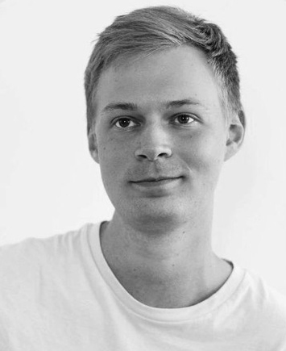

## Name
Pavel Knyazev
## Contacts
[Telegram](https://t.me/paszacz) 
**Mail**: pvshv1@gmail.com 
**Discord**: pvshv#2562(spaceJump1)
## About Me
I am 28 years old living in Saint-Petersburg and have a degree in Advertising and Public Relations. Until my last
job, I
worked in Internet advertising for nearly 6 years. However, due to a combination of circumstances, I experienced 
burnout and wanted to change my line of work. Since I already had some experience in HTML/CSS coding, I decided to 
delve deeper into development, learn JavaScript, and hopefully find my path in this field.

Currently, my main focus is on Vanilla JS/TS and frameworks (I'm also learning Angular). Since I already had some 
experience in coding, I am familiar with HTML5/CSS3/Bootstrap/@Media. At the moment, I am working on a personal 
project called 'Art Gallery' using Angular, Nest JS, and Mongo DB. The project is still in its early stages, but I 
have just started preparing it.